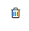
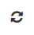
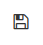
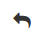
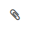
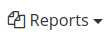
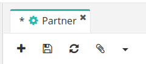
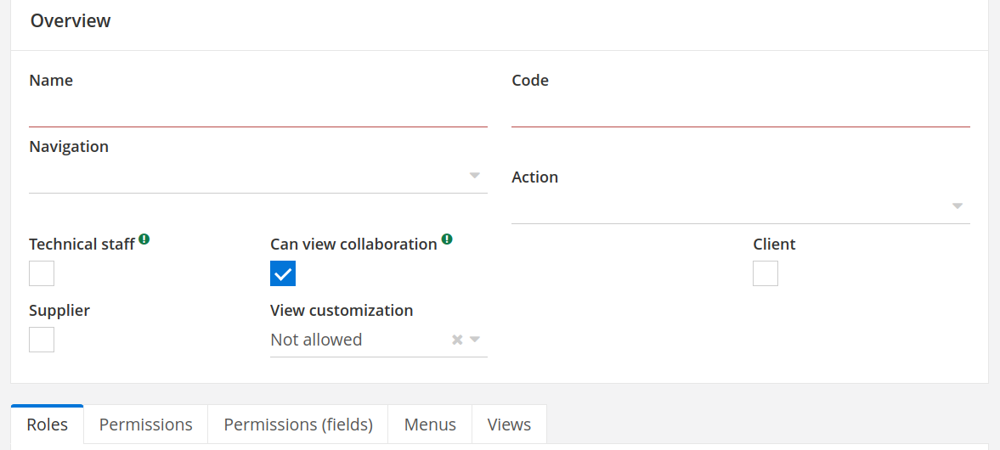
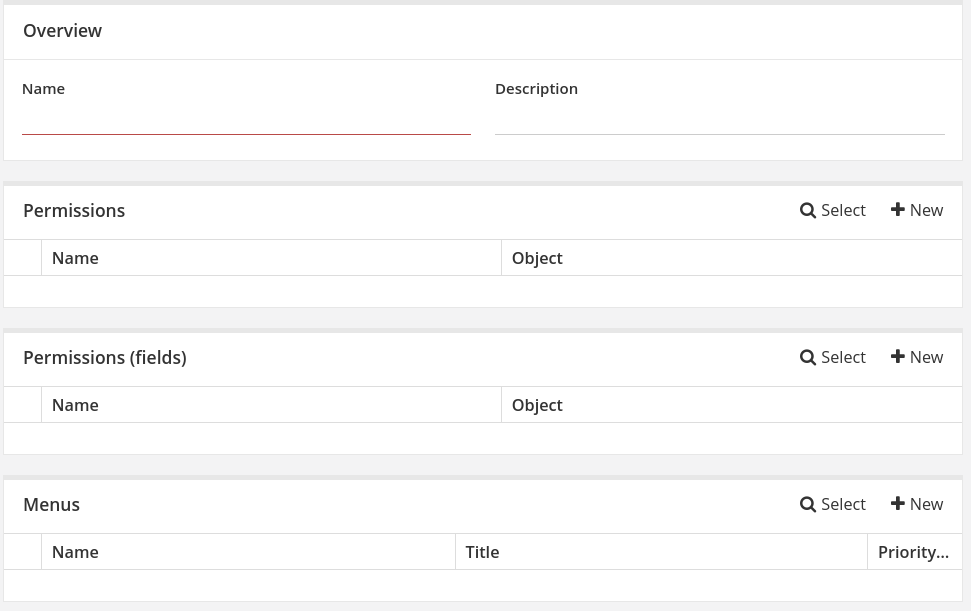
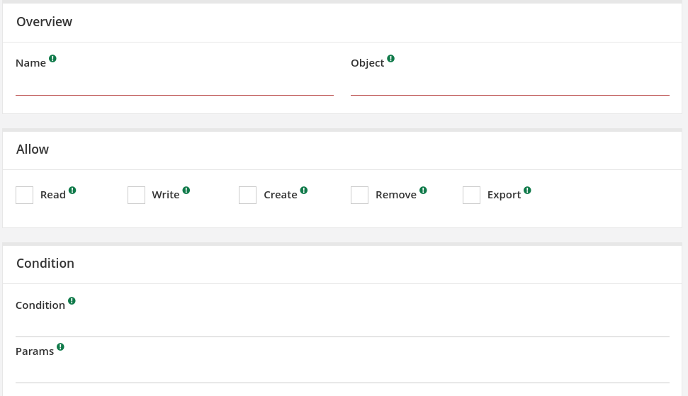

# Руководство пользования

## Основная часть

### Вход
Вот так выглядет вход в систему.

Как вы заметили, отсутствует кнопка регистрации, так как только пользователи с правами администратора, могут создавать других пользователей и наделить их правами доступа. Данная функция реализована ради безпасности системы.

Когда вы запускаете **GOVERP** первый раз, вам необходимо войти в систему как администратор.
> Username -> admin
> 
> Password -> admin

### Меню

Здесь мы видим главное меню.

Обычно всего "*этого*" (имеется ввиду этот огромный список в меню) не должно быть. Их нужно специально устанавливать в `Application Config`. Причина их присутсвия, в том, что в проекте, а именно в настройках(`axelor-config.properties`) мы указали, чтобы он изначально скачивал всё. В том же `Application Config` есть список всех модулей которые вы сможете установить или же удалить, если это потребуется.

То что вы сейчас видите, называют **элементом-меню**, они кликабельны(работают как кнопки), можно присвоить разные иконки и названия.

При нажатии на один из элементов-меню, вы откроете **вид**.

### Виды

Виды объектов представляют собой XML-определения пользовательского интерфейса для представления объектных моделей конечным пользователям. 

В некоторых из них вы сможете делать такие "действия" как:
+ Создавать записи 
+ Редактировать существующие записи 
+ Удалять записи 
+ Обновлять данные записи 
+ Сохранять записи 
+ Вернутся назад 
+ Прикрепить Файл 
+ Создавать отчёт 
+ Дублировать данные
+ Архивировать запись
+ Отследить последние изменения
+ А также присуствуют пользовательские функции
  + Проверить дубликат
  + Создать запись на основе другой записи
  + и т.д. большой список функций

Необходимо отметить, что видов существует несколько типов:
#### Сетка 

Представление сетки показывает данные в виде списка с несколькими столбцами.

#### Форма 

Представление формы показывает одну запись в макете формы. Это основной вид для просмотра записи с подробностями.

#### Дерево 

Представление в виде дерева показывает данные в виде [иерархического древовидного списка](https://ru.wikipedia.org/wiki/%D0%94%D0%B5%D1%80%D0%B5%D0%B2%D0%BE_(%D1%81%D1%82%D1%80%D1%83%D0%BA%D1%82%D1%83%D1%80%D0%B0_%D0%B4%D0%B0%D0%BD%D0%BD%D1%8B%D1%85)) с несколькими столбцами.

#### Календарь 

Представление календаря показывает данные с интерфейсом, похожим на расписание / повестку дня, с поддержкой перетаскивания.

#### Канбан 

Канбан-представление — это гибкая информационная панель, похожая на представление.

#### Карточки 

Представление карточек можно использовать для отображения связанных данных, таких как: фото, текст и ссылка об одном предмете, в виде карточек.

#### Звёдочка

Вам необходимо перейти нужные вам `сетку` или `форму` и нажать на соответсвующую кнопку `+`.
Далее, вам откроется форма, где вы должны заполнить все обязательные поля. После того, как проделали всё выше сказаное, вы можете заметить звездочку во вкладке. Она означает, что вы только что создали **новую** или же **изменили** существующий запись. После того, как нажмёте на кнопку сохранения, она исчезнет.

## Пользователи, группы, роли, привилегии

По названию оглавления, следует, что мы научимся создавать пользователя, добавим его в группу, присвоим ему роли и привилегии.

### Пользователь

1. Необходимо перейте по `Administration -> User Management -> Users`.
2. Нажать соответствующую кнопку `+`.
3. Далее заполняем обязательные поля, они подсвечены красной линией. 
>Вы можете нажать на кнопку сохранения для того, чтобы увидеть модальное окно в правом нижнем углу, где будет список полей, которые обязаны быть заполнеными.

>Возможно вы увидите поле **your password**, туда нужно будет ввести **ваш пароль** и чтобы потвердить что именно вы совершаете действие, ради безопасности. 

4. После того, как заполнили переходим на следующий этап, чтобы перейти, нажмите на 
5. Далее, появится список других полей, которые не обязательны для заполнения на тот момент, но можно и заполнить. Снова нажимаете на 
6. Переходим на этап `Activation`. Нажимаем на кнопку `Validate`. После нажатия, форма опять поменяет свой вид, но это уже окончателно.
7. **Поздравляю вы создали пользовтеля**!

### Группы

В основном группы нужны для того, чтобы разделить пользователей в группы, и дать им групповые привелигии и роли. Таким образом, вы можете здорово сэкономить время.

1. Для создания групп, нужно перейти `Administration -> User Management -> Groups`
2. Нажмите соответствующую кнопку `+`.
3. Заполните название и код, последний должен быть *уникальным*
   + Navigation - определяет нужно ли показывать боковое меню
   + Action - какое действие должно сработать после "входа в систему"
   + Technical staff - группа относится к техническому персоналу (в зависимости от ответа, появится доп. функции для технического персонала)
   + Can view collaboration - может ли просматривать совместную работу
   + Client - группа относится к клиентам
   + Supplier - группа относится к поставщикам
   + View customization - может ли группа изменять виды.
4. Далее вы можете связать/создать роли и привилегии, и их власть будет распростряняться ко всем пользователям, которые входят в группу.

### Роли

Роли нужны для распределения привилигиями, в отличии от группы, у одного пользователя может быть много ролей.

1. Для создания роли, нужно перейти `Administration -> User Management -> Roles`
2. Нажмите соответствующую кнопку `+`.
3. Заполните название.
4. Далее, вы уже можете присвоить привилегии.

### Привилегии

Привилегии – это права доверенного объекта на совершение каких-либо действий по отношению ко всей системе.

С ними вы можете разрешать или наоборот запрещать какие либо действия с моделями.

1. Для создания привилегии, нужно перейти `Administration -> User Management -> Permissions`
2. Нажмите соответствующую кнопку `+`.
3. Заполните **name** и **object**
>В поле **object** нужно будет написать ссылку на модель, а список модулей вы сможете взять из `Administration -> Model Management -> All Models`
1. Далее, необходимо указать привилегию с записями этой модели
   + Read - Предоставлять ли доступ для чтения.
   + Write - Предоставлять ли доступ для записи.
   + Create - Предоставить ли доступ для создания.
   + Remove - Предоставить ли доступ для удаления.
   + Export - Предоставлять ли экспортный доступ.
2. После, если вы хотите, можете добавлять условия в полях Condition и Params

